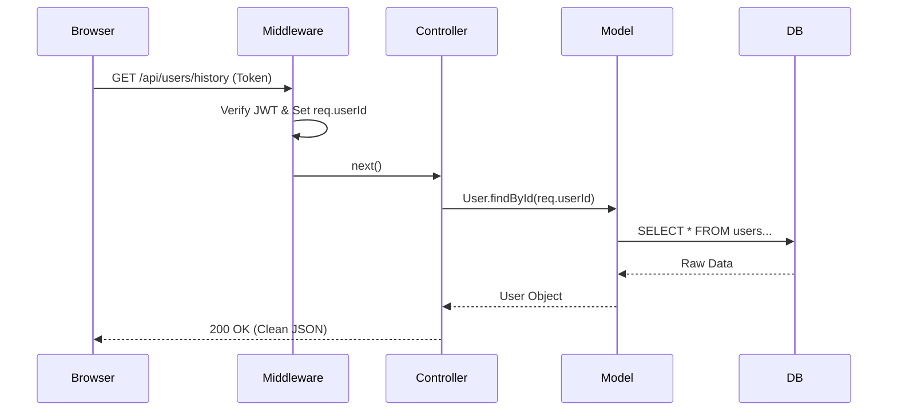

# Authentication and User Flow Explanation

This document explains how the different parts of your backend (Middleware, Controllers, and Models) work together to handle user sessions and data safely.

## 1. How Auth Middleware Syncs with Auth Controller

The "sync" happens through a shared **JWT Secret** and the **[req](file:///d:/Spotify/Backend/middleware/auth.middleware.js#26-56) object**.

| Component | Responsibility | Key Action |
| :--- | :--- | :--- |
| **Auth Controller** | **Issuer** (Creates the key) | During login, it signs a token: `jwt.sign({ userId: user.id }, SECRET)` |
| **Auth Middleware** | **Validator** (Checks the key) | For every request, it verifies the token: `jwt.verify(token, SECRET)` |

### The Bridge: `req.userId`
The most important part of the sync is line 13 in [auth.middleware.js](file:///d:/Spotify/Backend/middleware/auth.middleware.js):
```javascript
req.userId = decoded.userId;
```
Once the middleware verifies the user, it "attaches" their ID to the request object. This allows every other controller (like the User Controller) to know exactly who is making the request without having to re-verify the token.

---

## 2. Simultaneous Flow: Controller & Model

The Controller and Model work like a **Waiter** and a **Chef**.

### The Flow: `Request -> Middleware -> Controller -> Model -> Database`

Let's use [getInitialHistory](file:///d:/Spotify/Backend/controllers/user.controller.js#12-33) from your [user.controller.js](file:///d:/Spotify/Backend/controllers/user.controller.js) as an example:

1.  **Step 1: The Request**
    The user's browser sends a request to `/api/users/history`.

2.  **Step 2: The Guard (Middleware)**
    [protectRoute](file:///d:/Spotify/Backend/middleware/auth.middleware.js#4-25) runs. It checks the cookie/header, finds the user ID (e.g., `5`), and sets `req.userId = 5`.

3.  **Step 3: The Coordinator (User Controller)**
    The [getInitialHistory](file:///d:/Spotify/Backend/controllers/user.controller.js#12-33) function starts. It looks at `req.userId` and says: *"Okay, I need to get data for user #5."*

4.  **Step 4: The Specialist (User Model)**
    The Controller calls `User.findById(req.userId)`.
    *   The **Model** doesn't care about HTTP or tokens. It only knows how to talk to the SQL database:
        ```sql
        SELECT * FROM users WHERE id = $1
        ```

5.  **Step 5: The Response**
    The Model returns the user data to the Controller. The Controller then formats it nicely (using `ApiResponse`) and sends it back to the browser.

---

## Visual Summary



### Key Takeaway
*   **Middleware** handles **identity** (Who are you?).
*   **Controller** handles **logic** (What do you want to do?).
*   **Model** handles **data** (Where is the information stored?).
